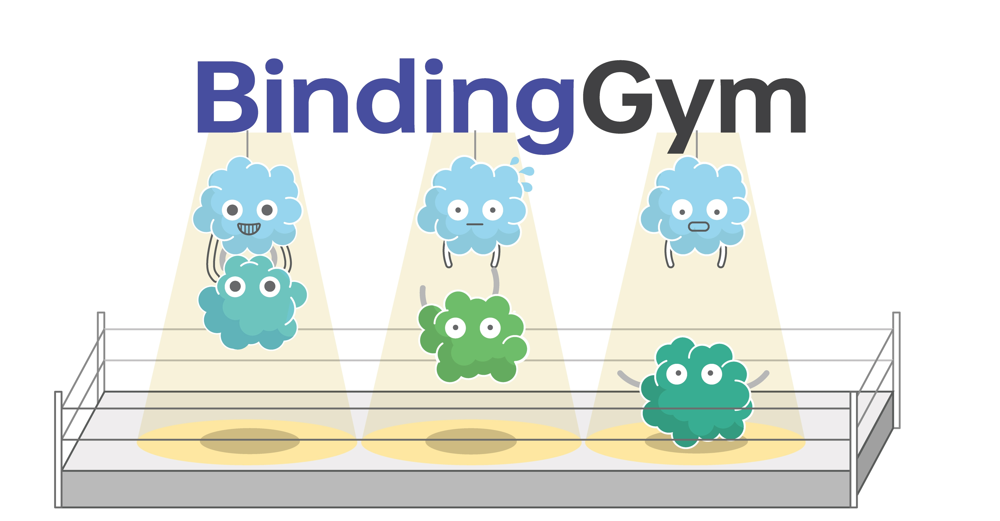

# BindingGym: A Large-Scale Mutational Dataset Toward Deciphering Protein-Protein Interactions

## Overview
BindingGym is a comprehensive dataset designed to advance the study of protein-protein interactions (PPIs). Containing millions of data points derived from binding-related deep mutational scanning (DMS) experiments, BindingGym serves as a robust resource for developing and benchmarking deep learning models. These models can predict the effects of mutations on protein binding affinity and enhance our understanding of protein-protein interactions.

## Features
- **Binding-Focused**: BindingGym exclusively collects DMS results pertinent to binding interactions, omitting data related to catalytic activity, fluorescence, and other phenotypes.
- **Comprehensive Protein Partner Modeling**: The dataset not only includes the mutated protein but also all its interacting partners, accurately reflecting the experimental setups.
- **Structure-Based Method Support**: Each target assay in BindingGym is meticulously paired with its corresponding protein complex structure through manual curation, enabling diverse computational approaches in the study of PPIs.
- **Diverse Data Splits**: The dataset is pre-split into various configurations to facilitate thorough comparisons between current and future models.
- **Inter-Assay Learning Support**: Assays are grouped and split by similarity in the inter-assay split, enhancing benchmark fairness and supporting the models' generalization capabilities in predicting PPIs.

## Getting Started
To get started with BindingGym, clone this repository and install the required dependencies. Detailed usage instructions and examples are provided below.

## Resources
The dataset is deposited at .

## License
BindingGym is released under the MIT license.

